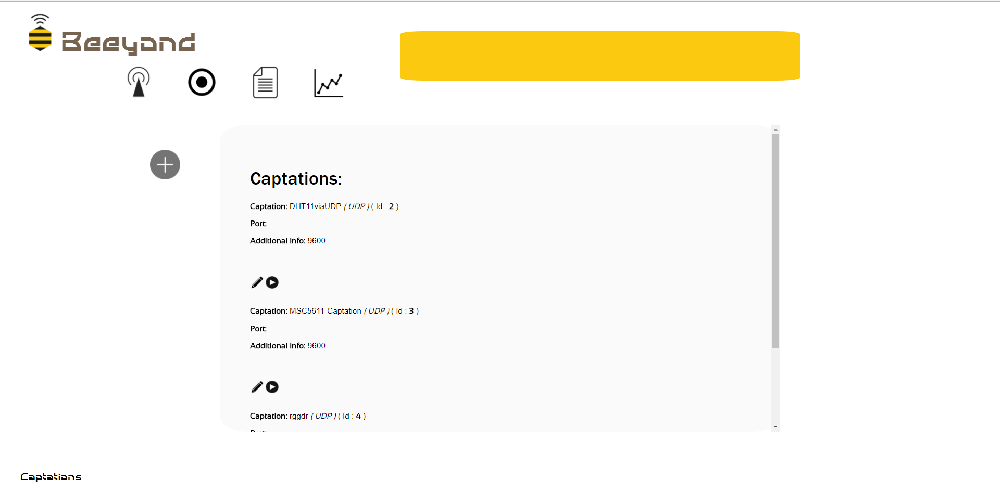

# NodeIot #
A repository for IoT with Node.js and React Native

## A Work in progress... ##

## A repository organized in 3 directories ##

* **Arduino/** directory is containing the files for the IoT part (C)
* **NodeJS-Beeyond/** directory is containing the files for the NodeJS server, interacting with IoT devices (Javascript)
* **ReactNative/** directory is containing the files for the mobile application, developped on ReactNative + native parts in Android (Java)

## Todo ##

* Wiki 
* Design the interface with Bootstrap 
* Add IoS support on ReactNative app


# Beeyond Streamer #

Beeyond Streamer is a NodeJS server which allows you to execute multiple streams in real-time of sensors remotely through the UDP protocol.



### What is this repository for? ###

* Beeyond Team
* Version
* [Learn Markdown](https://bitbucket.org/tutorials/markdowndemo)

## How do I get set up? ##

* Overview of set up
* Configuration
* Database configuration
* Network requirements
* Devices
* How to run tests
* Deployment instructions

## Instructions ##

### Overview of set up ###
To set-up the project you will need to install MySQL, and NodeJS on your computer. ( See Configuration & Database configuration) 
You will need to access to a configurable network depending on which micro-controllers you'll use. ( See Devices )
In our case, we used ESP32 devices  ( Official Website : https://www.espressif.com/en/products/hardware/esp32/overview ; Documentation https://en.wikipedia.org/wiki/ESP32 )
so we are actually unable to join WPA2-EAP enterprise networks ( maybe possible ? ), so we used a dedicated router even there are not so many configuration you will need
to set-up on your network ( See Network requirements )

### Configuration ###
First you have to install MySQL . There are many ways to install MySQL . 
For my case, I use Wamp which get MySQL integration. 

* Windows
Install MySQL via WAMP : http://www.wampserver.com/
Install NodeJS : https://nodejs.org/en/download/

* OSX
Install MySQL via MAMP : https://www.mamp.info/en/
Install NodeJS : https://nodejs.org/en/download/

* Linux ( Ubuntu )
Install MySQL via LAMP : https://www.digitalocean.com/community/tutorials/how-to-install-linux-apache-mysql-php-lamp-stack-on-ubuntu-16-04
Install NodeJS : https://nodejs.org/en/download/

### Database Configuration ###

* Create a Database on your Mysql interface ( in my case, phpMyAdmin ) 
* Select your database ( via your mySql interface , or in terminal (after running mysql in command-line : USE my_database )
* Import the database beeyond .sql ( via your mySql interface , or in terminal (after running mysql in command-line : SOURCE beeyond.sql , (called in folder containing beeyond.sql ) )
* Create a mySql user for your database . >>> Username : beeyondUser // Password : beeyond123 
* Give required privileges to your User , minial privileges are INSERT , SELECT , UPDATE , REMOVE , TRUNCATE 
* Your mySQL credentials are defined in /src/mySqlCredentials.txt ( you can change your username / password , and edit this file to put your own configuration )

### Network requirements ###

You have to connect devices and server on same network. Your micro-controllers needs to support the network configuration.
( as already said, actually we get troubles to connect WPA2-EAP networks ).
The application is using ports 8081-8090 so you need to ensure that theses ports are open on your router ( on many routers it already is by default on localnetwork )
You don't necesseraly have to be connected to Internet to run the Streamer app. 
The only IP you need to know is the IP of your Server

On Windows:
```
ipconfig
```

On UNIX:
```
ifconfig
```

### Devices ###

We used for our purpose ESP32 devices, but you can use any micro-controller you want as long as it provides Wifi connection.

* ESP32 Arduino Installation on Windows
https://github.com/espressif/arduino-esp32/blob/master/docs/arduino-ide/windows.md

* ESP32 Arduino Installation on OSX
https://github.com/espressif/arduino-esp32/blob/master/docs/arduino-ide/mac.md

* ESP32 Arduino Installation on Linux
https://github.com/espressif/arduino-esp32/blob/master/docs/arduino-ide/debian_ubuntu.md


This Arduino block code is illustrating how to send easily data from your micro-controller to your server
( it's a sample from the Arduino example sketch ESP32-WiFiUDPClientB.ino )

```
WiFiUDP udp;

udp.begin(WiFi.localIP(),udpPort); // START CONNECTION

udp.printf("%d *** %d *** %.6f",intValueA, intValueB, floatValueWithSixDigitsFloating); // SEND 
```

* ESP32 Arduino configuration:
When you're done with the Arduino Installation of your device , you can define it on your Arduino environnment ( in Tools Section )
In my case I defined:
Board : ESP32 Dev Module
Flash Mode : QIO
Flash Size : 4 mb
Flash Frequency : 80 mhz
Upload Speed : 921600
Core Debug Level : None
Port : COM17


### How to run tests ###


* Micro-controller Side
On Arduino define your board and your port + additio ( in my case 

When you are done with the ESP32 Arduino configuration, you can upload ESP32-WiFiUDPClient-dht11.ino (in Arduino/)to start the UDP communication process
Define theses 3 parameters depending on your network environnement before uploading the sketch: 

```
// WiFi network name and password:
const char * networkName = "YOUR_SSID"; // YOUR NETWORK SSID
const char * networkPswd = "*********"; // YOUR NETWORK PASSWORD

const char * udpAddress = "192.168.8.170"; // THE IP ADDRESS OF THE SERVER WHERE THE NODEJS APP IS RUNNING
```

In this sketch , we are sending the values of the DHT11 sensor ( https://www.dfrobot.com/wiki/index.php/DHT11_Temperature_and_Humidity_Sensor_(SKU:_DFR0067) ) capting temperature and humidity. 
You have to install the SimpleDHT11 library
https://github.com/winlinvip/SimpleDHT
Extract the folder repository & Put it in Arduino/libraries
( If you don't have a DHT11 sensor you still can run the code and send fake data to test the communication process is working on your side,
just run the ESP32-WiFiUDPClient-fakeData.ino (in Arduino/) ) 

* Server Side
```
npm install
node app.js
```

Now the application is launched , you can access to the captations list right here : 
http://localhost:8080/captations

Click on the play icon below DHT11viaUDP

Now you can see the real-time graph of DHT11 value 


### Deployments ###

After understanding the UDP communication process to the server, you can easily implements captations template for your owns sensors.
* First, you have to create a sensor:
Go to http://localhost:8080/newSensor
Define the name of the sensor and the values is supposed to track.
* When you're done , you can create a captation for your sensor:
Go to http://localhost:8080/captation/create&0 
Select your sensor , Select UDP for protocol and Submit

* Now you should be able to see your captation in the captations list
Go to http://localhost:8080/captations
Check your captation Id , written in Captation line 


* You have to implement the data sending on your your micro-controller side :
For example this captation is capting two int and a float

I should create an Arduino sketch for my new captation where I will put:
```
int captationId = 6; // Your captation Id

udp.printf("%d *** %d *** %d *** %.6f",captationId,intValueA, intValueB, floatValueWithSixDigitsFloating); // SEND 
```

### Who do I talk to? ###

* This repository is a private repository with configuration & deployment instructions, it should be public in a later time.
* If you have any technical question , feel free to email me at sachaamm@gmail.com
